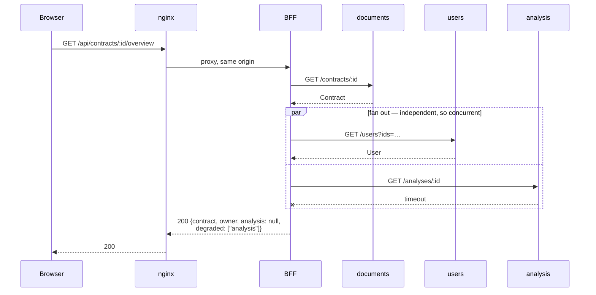
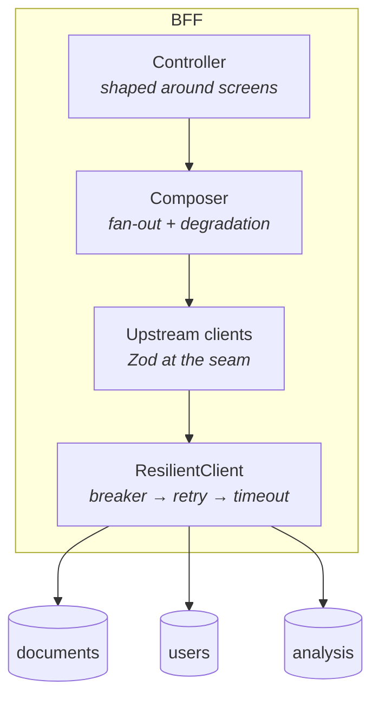
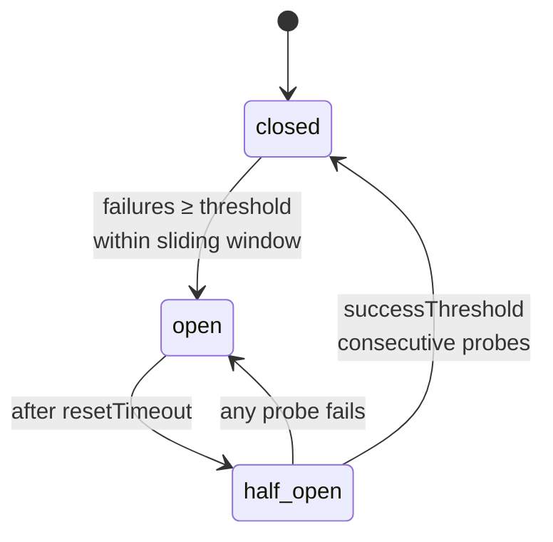

# Architecture

## The shape of a request

The contract is fetched first because everything else depends on knowing who
owns it. Owner and analysis are independent of each other, so they go out
together — the screen costs one round trip plus the slowest of two, not the sum
of three.

The `analysis` timeout does not become a 500. It becomes a named absence.

## Why the layers sit where they do

Each layer knows only about the one below it:

| Layer | Owns | Deliberately does not know |
|---|---|---|
| Controller | HTTP shape, status codes | that there are upstreams at all |
| Composer | what a screen needs, degradation policy | HTTP, retries, timeouts |
| Upstream clients | endpoint paths, schema validation | resilience policy |
| ResilientClient | breaker, retry, timeout, correlation ids | the domain |

That separation is why the composer's tests run in 25ms with no network, no
container and no mock framework — it takes plain objects and returns plain
objects.

## The three states of "no data"

The single most important distinction in this codebase. Collapsing these is the
bug the whole design exists to prevent.

| Situation | HTTP | `analysis` | `degraded` | What the UI says |
|---|---|---|---|---|
| Contract does not exist | 404 | — | — | Not found |
| Contract exists, never analysed | 200 | `null` | `[]` | "Not analysed yet" |
| Analysis service unavailable | 200 | `null` | `["analysis"]` | "Currently unavailable" |

The last two produce an identical `analysis: null`. Only `degraded` separates
them, and they demand opposite reactions from the user: one is a task to
assign, the other is a page to reload.

Rendering both as an empty state would be worse than an error page. A contract
displaying no findings looks *safer* than one displaying three — which is
exactly backwards when the truth is that nothing was checked.

## Failure behaviour

The breaker wraps the retry loop, never the other way round. Inverted, one
logical call with three retries would count as three failures and trip the
circuit on a single flaky request — while the retries kept hammering an upstream
already known to be down.

`half_open` admits exactly one probe. Without that, recovery is a thundering
herd: every waiting request hits the just-recovered service at once and knocks
it straight back over.

Breakers are per-upstream. A dead `analysis` must not stop `users` from being
called — that isolation is the difference between a contained incident and a
total outage.

## Timeouts are per-upstream, not shared

| Upstream | Budget | Why |
|---|---|---|
| `users` | 300ms | A key lookup. Slower than this means something is wrong. |
| `documents` | 500ms | Slightly more work, still fast. |
| `analysis` | 800ms | Risk scoring is genuinely expensive. |

A single shared timeout has to be set for the slowest, which means fast
upstreams are allowed to hang far longer than they ever should — or set for the
fastest, which means constantly degrading a healthy `analysis`. Neither is
acceptable, so they are tuned separately.

## What is deliberately absent

- **A database.** The BFF owns no state. The moment it does, it stops being a
  view-composition layer and becomes a service other teams depend on.
- **Auth.** Out of scope for this demo, but it belongs here in production — the
  BFF is the natural place to exchange a session for upstream credentials so
  the browser never holds them.
- **A cache.** The composition is cheap and the data changes often enough that
  correctness matters more than latency here. When it is added, it belongs in
  `ResilientClient`, keyed per upstream, with stale-while-revalidate — so a
  degraded upstream can serve slightly old data instead of nothing.
